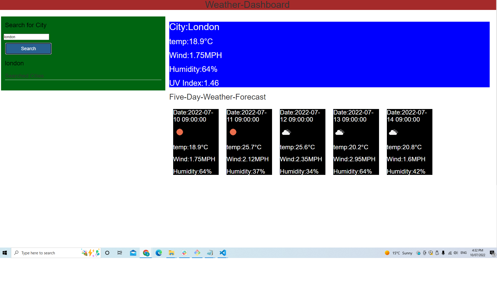

# Weather-Dashboard
## User Story
```
I have designed a weather app which diplay weather for next 5-days for a given searched city.
This Weather app searches for Temperature, Wind, Humidity and UV Index aswell.


```
## Criteria

I creaeted this weather application by registering into []https://openweathermap.org/api.
When I registred and gained access I am able to fetch the data from API.
When the information is serached for a given city its looks for weather details for next 5-days and also current day.
Current day weather is displayed on main card along with UV index.
In the bootom next 5-days weather is displyaed along with current day.

## Mockup
 Demo screenshots of my weather application
 Demo1 shows how my landing page looks like
 
 Demo 2 shows the weather displayed on the main card and also 5 remaining cards presented
 
Demo 3 shows the searched city is retrived into recent search history 
 

# Link to live site
https://sudheer313.github.io/Weather-Dashboard/

## Reason why I made this Weather-Dashboard

I created this to display weather for any given city.
It also display date for which its diplaying the weather and also images displays immages of weather in the cards provided.
The purpose is to mainly gather weather inforamation from an API and represent them back to the user.

## What I learned
I learned fetch calls and promises while devoloping this application I also got learneed how to call functions and return values. I also learned to store data in local storage in retrive this back. This is the most important task I learned doing this.

## Challalanges
At first I was I had difficulty in fetching data from an API. When I finally fetched data , it was hor for me to read that data. Then I had problem with storing then into local storage and fetching them back.
But finally I was able to overcome this difficulty and overcome this.


